# ALTO Pro Low-Ticket: Website Generator (`/pagina`, $49), Engineering Handoff

**Updated:** 2026-10-07
**Source of truth:** `bonalti1/ALTO-PRO-LOW-TICKET` → `alto-pro-website-generator.zip`, a snapshot of the
ALTO Pro monolith taken from branch `claude/inspiring-lamport-qeh1wi`. The zip's contents are unpacked
unchanged in [`code/`](code/).

This folder contains:

| Path | What it is |
|---|---|
| [`HANDOFF.md`](HANDOFF.md) | This document. Read it first. |
| [`code/`](code/) | The full source, unchanged from the zip. |
| [`code/HANDOFF.md`](code/HANDOFF.md), [`code/CLAUDE.md`](code/CLAUDE.md) | The original handoff and project brief that shipped in the zip. |
| [`screenshots/`](screenshots/) | 83 screenshots of every frontend screen, taken from a local run on 2026-10-07. |
| [`scripts/capture-screenshots.mjs`](scripts/capture-screenshots.mjs) | The Playwright script that took them. It drives the funnel end to end, including a signed Stripe webhook. |

---

## 1. What we want (the product)

**One sentence:** a Hispanic roofer or fence contractor sees an ad, fills in 6 fields, and **within a
minute sees their own finished website**. If they like it, they pay **$49 once**, and it is live
right away with no human involved.

Business rules the owner has locked:

- **Price:** $49 one time, and that price is final. Spoken ads say "menos de cincuenta dólares".
  **Hosting is $19/month starting in month 2**, and this is disclosed at the point of sale (form fine
  print, preview claim bar, and welcome page).
- **Trades in v1:** techos (roofing) and cercas (fence) only. Ads can pre-select the trade with
  `/pagina?t=cercas` or `?t=techos`.
- **"The preview IS the product."** The preview goes through the same `renderSite()` that every paying
  client's site uses. What the visitor customizes is exactly what gets published.
- **Lead first.** The lead goes to the `alto-ventas` inbox (src `pagina-funnel`) before the preview
  renders, so setters can follow up with people who don't buy.
- **No fake content.** A real business preview has `reviews: []`. There are no AI images presented as
  the client's own work. Photos are uploaded by the contractor.
- **Spanish first,** in a warm contractor tone.
- **Zero-touch fulfillment.** Stripe webhook → account → published site → `/bienvenida` gives the buyer
  their live link and an editor link.
- **The upsell is the $67 app.** Plan `pagina` is site-only, and the measuring APIs refuse it
  server-side.
- **Every generated site embeds the live AI quote widget** (`/w/<slug>`). This is the core value: the
  site produces quotes by itself 24/7.

### Funnel at a glance

```
Ad ──► /pagina form ──► lead → alto-ventas ──► POST /api/pagina/draft (kv pgdraft:<id>)
         │                                        │
         └── "construction" interstitial (~4.6s) ─┘
                              ▼
          GET /pagina/preview?d=<id>   (real renderSite() + ribbon + claim bar)
                              ▼
     reveal toast (≈4s) ──► 6-step wizard: estilo · color · negocio · logo · fotos · texto
           (each choice POSTs /api/pagina/draft/:id and reloads; server re-renders)
                              ▼
     🚀 ESTRENARLA $49  ──► Stripe Payment Link  ?client_reference_id=pagina-<id>
                              ▼
     /api/stripe/webhook ($49 → plan "pagina") ──► paginaSiteFromDraft() ──► account + PUBLISHED site
                              ▼
     /bienvenida?session_id=…  ──► 🌐 VER MI PÁGINA  ·  ✏️ Editar mi página (site-only app)
```

---

## 2. Frontend walkthrough (screenshots)

All images are in [`screenshots/`](screenshots/). The prefix tells you the device and trade:

- `m-` is mobile (390×844 @2x). Ads are mobile, so this is the primary target.
- `d-` is desktop (1440×900).
- `fence` / `roof` is the trade.
- `tpl-` is a template rendered alone (`bare=1`).
- `c-` is a fully customized draft (logo, photos, services, AI copy, socials).

### 2.1 Landing + form: `GET /pagina`
| Mobile (fence) | Mobile (roof) | Desktop |
|---|---|---|
| 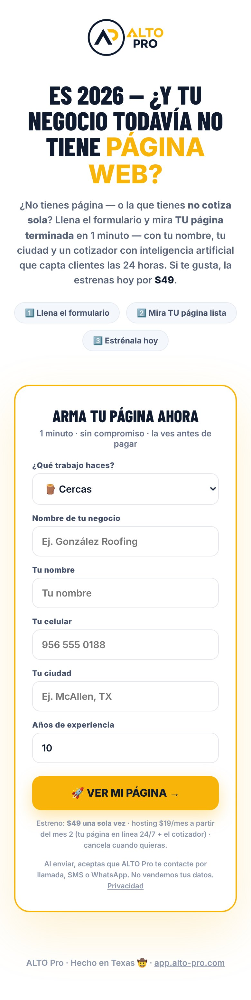 |  | 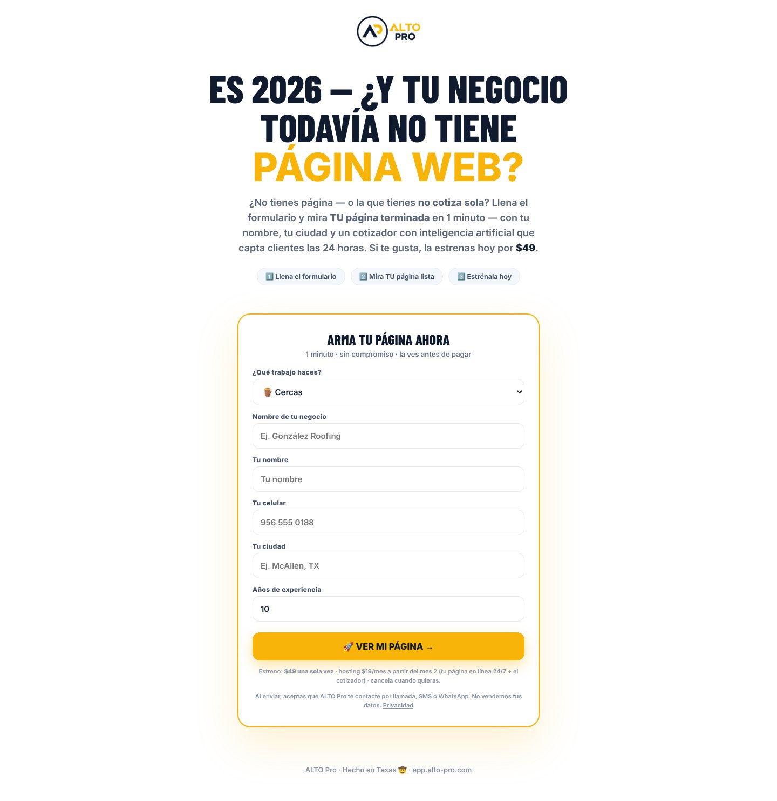 |

| Filled | Phone validation | Construction interstitial |
|---|---|---|
| 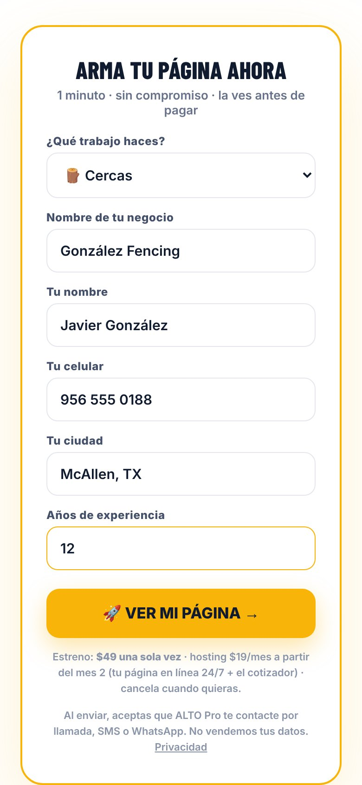 | 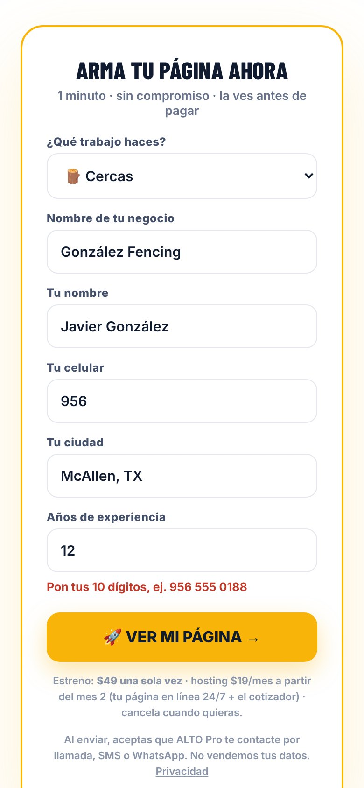 | 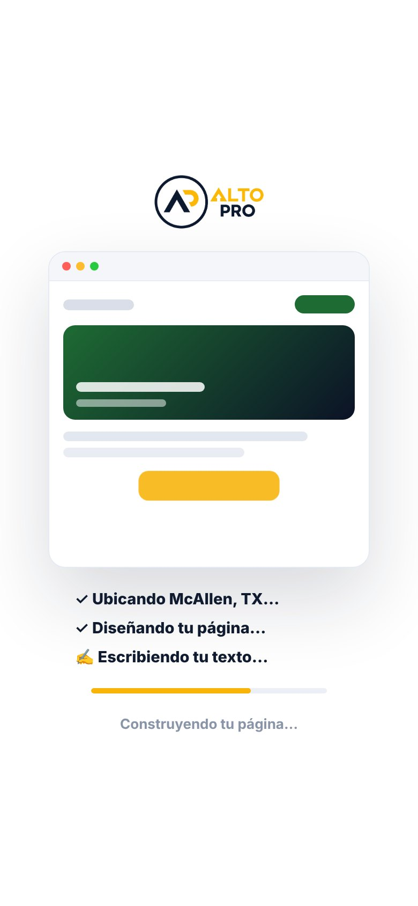 |

### 2.2 Preview reveal: `GET /pagina/preview?d=<id>`
On the first visit, the visitor gets about 4 seconds to look at the page with a "¡Así quedó tu página!"
toast. After that, the wizard opens by itself.

| Reveal toast | Full preview page (mobile) | Full preview page (desktop) |
|---|---|---|
| 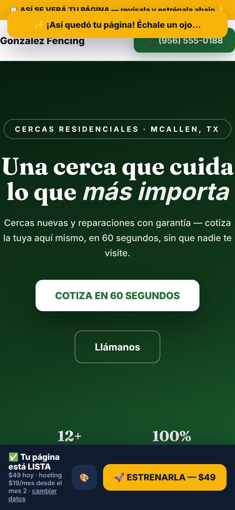 |  | 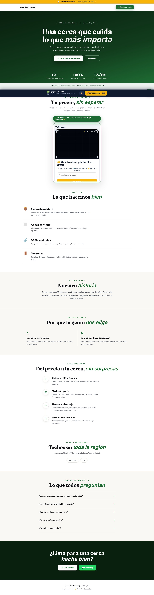 |

### 2.3 The 6-step customize wizard
| 1 Estilo | 2 Color | 3 Negocio |
|---|---|---|
| 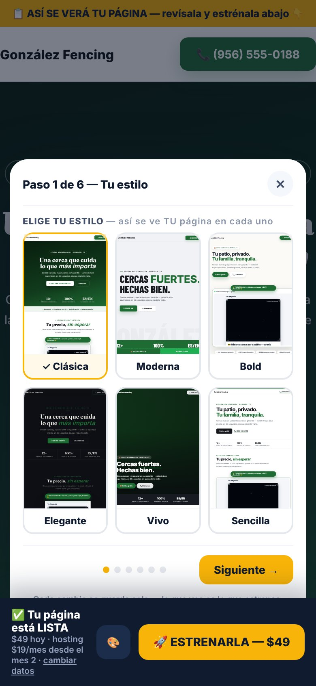 | 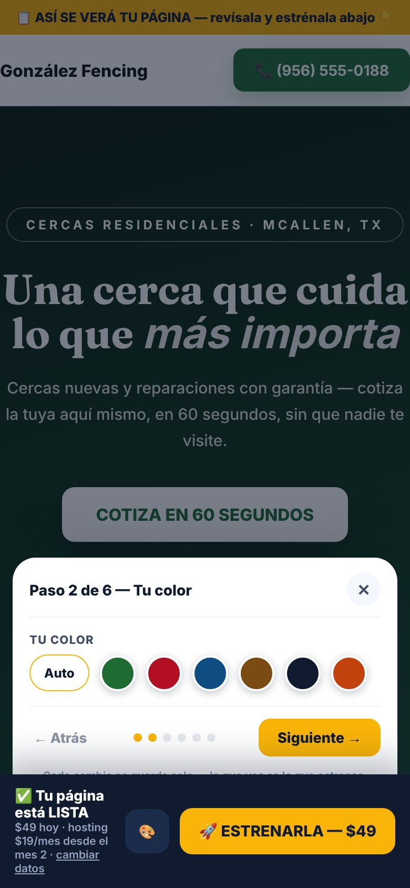 | 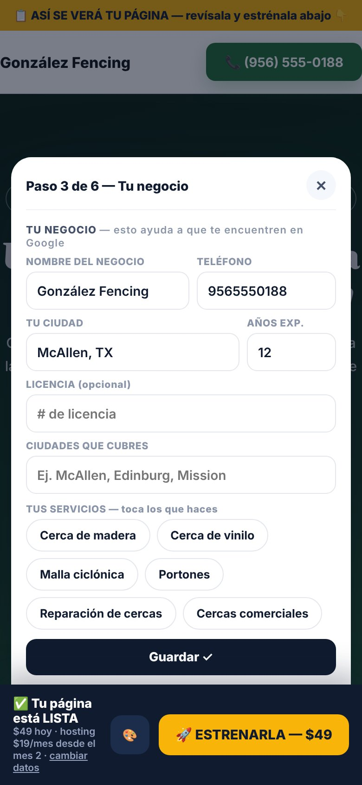 |

| 4 Logo | 5 Fotos | 6 Texto |
|---|---|---|
| 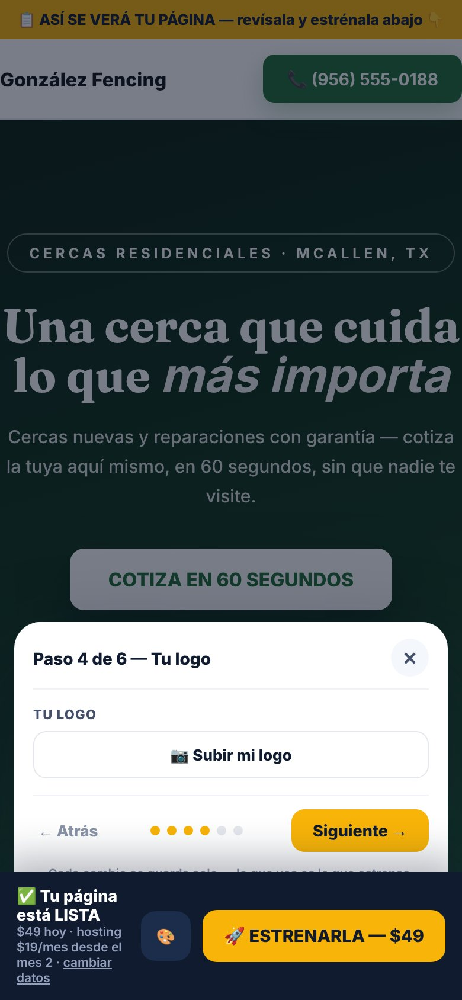 | 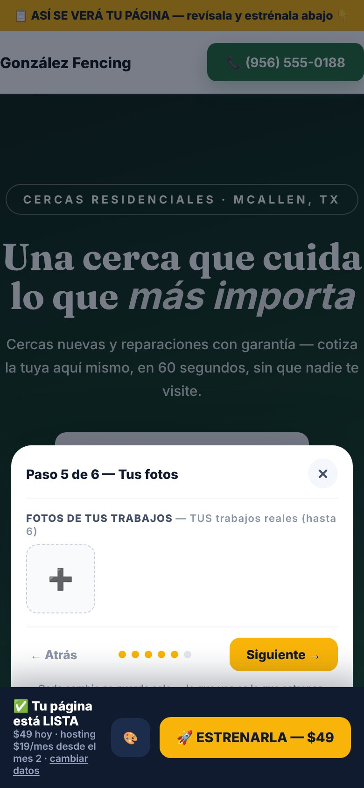 | 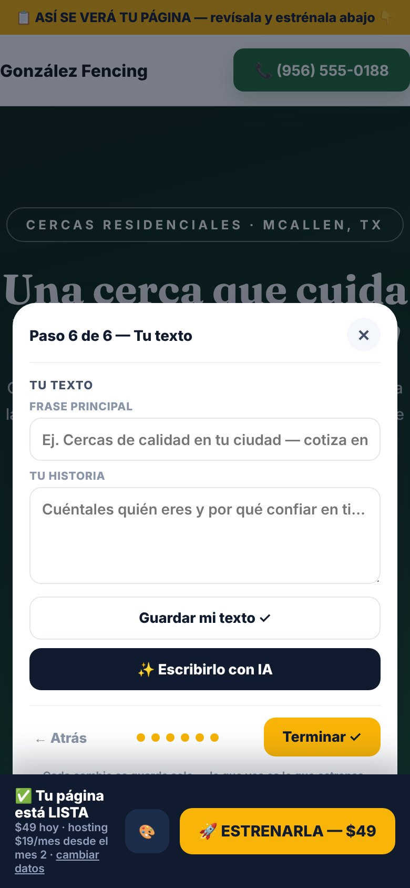 |

| Done toast | Claim bar | 🎨 Full panel (top) | 🎨 Full panel (bottom: redes) |
|---|---|---|---|
| 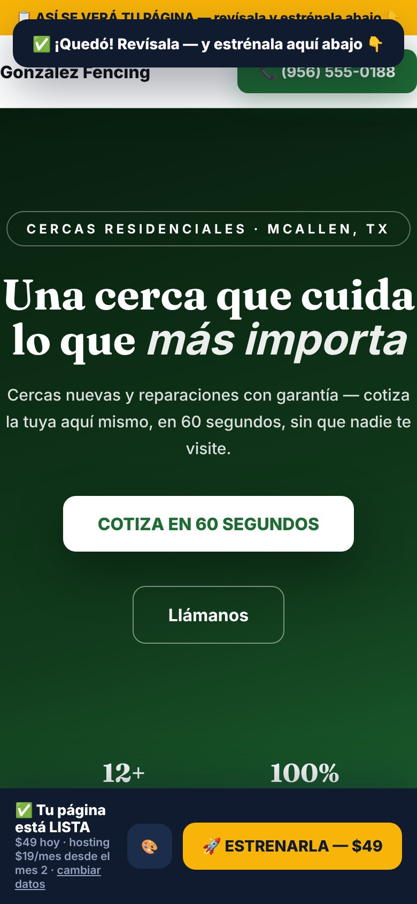 | 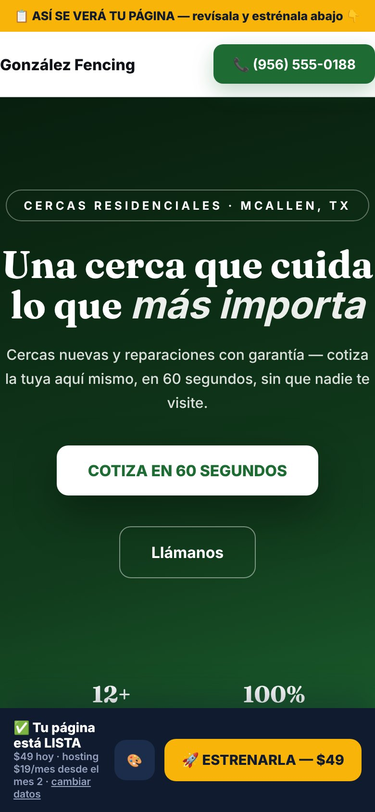 | 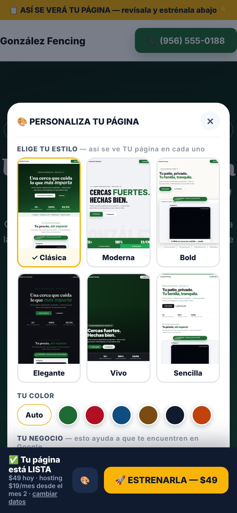 | 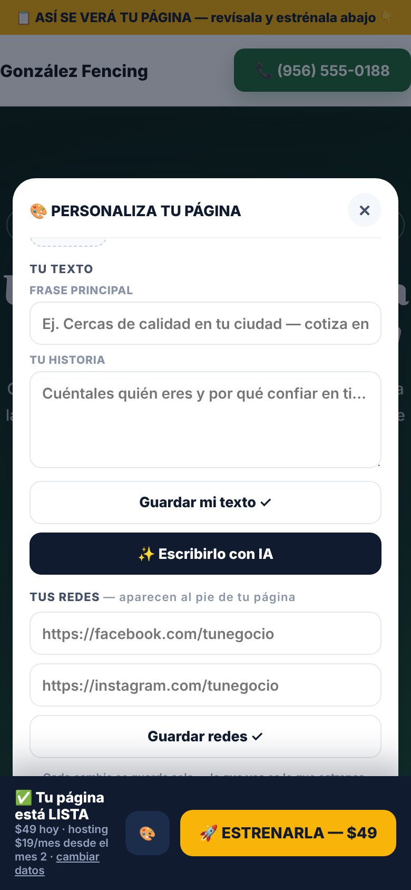 |

The same screens exist for roofing (`m-roof-07-…` through `m-roof-11-…`) and desktop (`d-fence-07-…` through `d-fence-11-…`).

### 2.4 The 6 templates
Templates 1–3 serve existing paying clients and their output must stay **byte-identical**. Templates 4–6 were added later.

| # | Name | Fence (desktop) | Roof (desktop) | Fence (mobile) |
|---|---|---|---|---|
| 1 | Clásica | [img](screenshots/tpl-fence-1-clasica-desktop.jpg) | [img](screenshots/tpl-roof-1-clasica-desktop.jpg) | [img](screenshots/tpl-fence-1-clasica-mobile.jpg) |
| 2 | Moderna | [img](screenshots/tpl-fence-2-moderna-desktop.jpg) | [img](screenshots/tpl-roof-2-moderna-desktop.jpg) | [img](screenshots/tpl-fence-2-moderna-mobile.jpg) |
| 3 | Bold | [img](screenshots/tpl-fence-3-bold-desktop.jpg) | [img](screenshots/tpl-roof-3-bold-desktop.jpg) | [img](screenshots/tpl-fence-3-bold-mobile.jpg) |
| 4 | Elegante | [img](screenshots/tpl-fence-4-elegante-desktop.jpg) | [img](screenshots/tpl-roof-4-elegante-desktop.jpg) | [img](screenshots/tpl-fence-4-elegante-mobile.jpg) |
| 5 | Vivo | [img](screenshots/tpl-fence-5-vivo-desktop.jpg) | [img](screenshots/tpl-roof-5-vivo-desktop.jpg) | [img](screenshots/tpl-fence-5-vivo-mobile.jpg) |
| 6 | Sencilla | [img](screenshots/tpl-fence-6-sencilla-desktop.jpg) | [img](screenshots/tpl-roof-6-sencilla-desktop.jpg) | [img](screenshots/tpl-fence-6-sencilla-mobile.jpg) |

The same 6 templates are also rendered with a **fully customized** draft (logo, 4 job photos, blue color,
license, 4 service chips, coverage area, AI copy, socials): `c-fence-04-customized-tpl1…6-*.jpg`, plus
`c-fence-03-customized-preview-mobile.jpg`.

### 2.5 Purchase → live site
These screens come from a real HMAC-signed `checkout.session.completed` webhook ($49,
`client_reference_id=pagina-<id>`) sent to the local server.

| `/bienvenida` (mobile) | `/bienvenida` (desktop) | Buyer's app (site-only) |
|---|---|---|
| 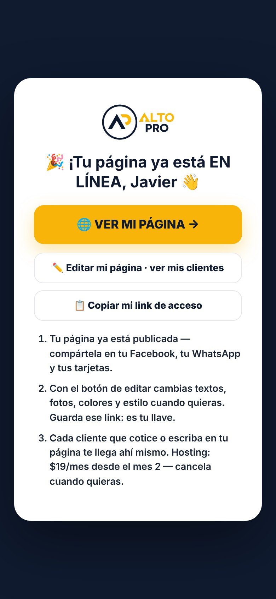 | 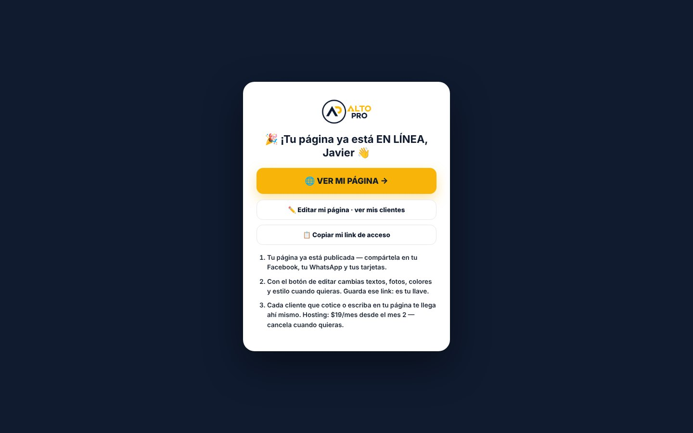 | 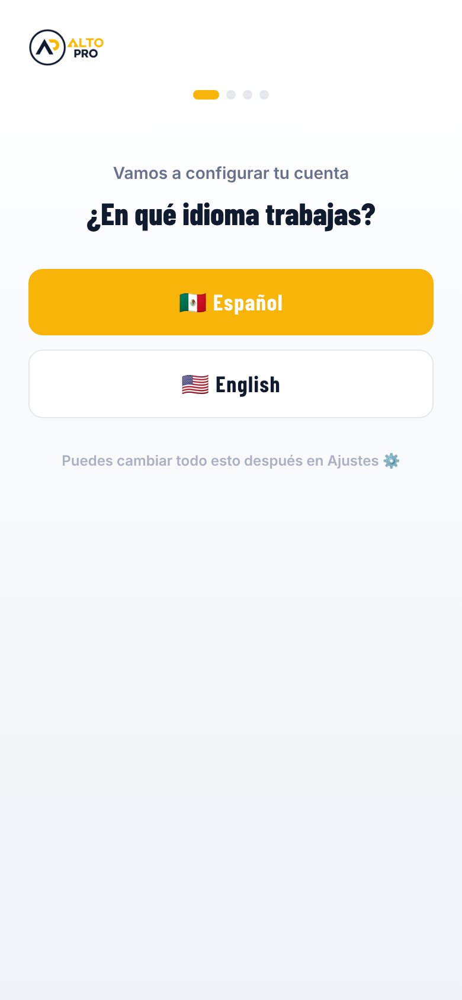 |

The published site at `/site/<slug>` (the buyer's deliverable): [mobile](screenshots/m-buy-02-published-site.jpg) · [desktop](screenshots/d-buy-02-published-site.jpg)

### 2.6 Other surfaces
- The embedded quote widgets: [`/w/alto-cercas`](screenshots/widget-alto-cercas.jpg) · [`/w/alto-demo`](screenshots/widget-alto-demo.jpg)
- The legacy query-string preview, which is the fallback when the draft API fails and has no customizer: [img](screenshots/m-legacy-querystring-preview.jpg)

> **Local-run caveats in the screenshots:** the satellite map inside the widget is black because no
> Google key was set (demo mode). The hero is a color gradient because `public/landing/hero-fence.jpg` /
> `hero-roof.jpg` are not in the snapshot. The site falls back gracefully in both cases. The AI copy is
> one of the canned variants because no AI key was set.

---

## 3. Where the code is

The generator is **not a separate package**. It lives inside the Express monolith. Line numbers below
were verified against the snapshot.

### `code/server/index.mjs` (12,788 lines)

| Line | Anchor | What |
|---|---|---|
| 70 | `const PAGINA_ENABLED` | Feature flag. When off, `/pagina` returns 302 → `/app`. |
| 330–336 | `PLANS.pagina` | `{ price: 19 }`, the hosting number that MRR counts |
| 355 | `clientLocked()` | Returns `"siteonly"` for plan `pagina` |
| 379 | `PLAN_BY_AMOUNT` | `4900: "pagina"` |
| 386 | `STRIPE_LINKS.pagina` | `STRIPE_LINK_PAGINA` env |
| 396 | `POST /api/stripe/webhook` | Signature check, customer match (L444), auto-provision (L449+), pagina branch (L469–490) |
| 7000 | `GET /api/checkout-result` | Polled by `/bienvenida`; returns `siteUrl` + `accessUrl` |
| 7009 | `GET /bienvenida` | Welcome page; switches to the pagina layout when `siteUrl` is present |
| 7229 | `/* ── /pagina` | **Start of the generator block** |
| 7240–7248 | `PG_COLORS`, `PG_TPL_IDS`, `PG_TPL_NAMES`, `PG_SVC` | Whitelists |
| 7255 | `paginaSiteFromDraft(d)` | Draft → `{trade, profile, site}` |
| 7281 | `GET /api/pagina/photo/:id/:i` | Draft photo as an image (panel thumbnails) |
| 7290 | `POST /api/pagina/draft` | Creates an anonymous draft (20/IP/day) |
| 7309 | `POST /api/pagina/draft/:id` | **The PATCH.** All validation lives here. |
| 7353 | `PG_COPY` | Canned copy (3 per trade) used when there is no AI key |
| 7371 | `POST /api/pagina/copy/:id` | AI copywriter (6 per draft, 15/IP) |
| 7402 | `POST /api/pagina/voice/:id` | Voice note → Whisper → copy (needs `OPENAI_KEY`; 4 per draft) |
| 7447 | `paginaPage(req)` | Form page HTML + interstitial + client JS |
| 7611 | `GET /pagina` | |
| 7620–7935 | `GET /pagina/preview` | Render, video-hero post-process, customizer HTML/JS (`toolbar`), claim bar (`bar`), `?tpl=N` and `&bare=1` |
| 7940 | `siteDataOf()` | Account → renderSite data (published sites) |
| 7987 | `GET /site/:slug` | The published client site |

### `code/server/templates.mjs` (1,406 lines): the website factory
| Line | Anchor | What |
|---|---|---|
| 50 | `TRADE_WORDS` | Per-trade phrase pack |
| 97 | `SVC_LOOKUP` | Service chip string → icon + copy card |
| 278 | `widgetSpotBits(d)` | Glow + badge around the quote widget, shown on previews only |
| 335–340 | `RV_CSS` / `RV_JS` | Scroll-reveal animation (`[data-rv]`, IntersectionObserver) |
| 1292 | `const TEMPLATES` | 1 Clásica · 2 Moderna · 3 Bold · 4 Elegante · 5 Vivo · 6 Sencilla |
| 1294 | `export function renderSite(data, opts)` | Entry point. `opts.ribbon` and `opts.chat` are used. |

### Draft model (kv `pgdraft:<12-hex id>`)
```js
{
  trade: "fence" | "roofing",
  biz, name, phone /* digits ≤11 */, city, years /* 1..60 */,
  template: "1".."6", color: "" | one of PG_COLORS, logo: null | "data:image/png|jpeg;base64,…" /* ≤300KB */,
  tagline /* ≤140 */, about /* ≤450 */, area /* ≤140 */, license /* ≤40 */,
  services: string[] /* ≤8 × 40 chars */, photos: dataURL[] /* ≤6, ≤320KB each, ≤1.5MB total */,
  facebook, instagram /* https only */, aiN, vN, created
}
```

### API contract (all JSON, all anonymous, all gated by `PAGINA_ENABLED`)
| Method + path | Body | Returns |
|---|---|---|
| `POST /api/pagina/draft` | `{trade,biz,name,phone,city,years}` | `{ok:1,id}` |
| `POST /api/pagina/draft/:id` | any subset of the draft fields, plus `photosAdd: dataURL[]` and `photoDel: index` | `{ok:1}` |
| `POST /api/pagina/copy/:id` | none | `{ok:1,tagline,about}` |
| `POST /api/pagina/voice/:id` | `{audio: base64, mime}` | `{ok:1,about,tagline}` |
| `GET /api/pagina/photo/:id/:i` | none | image bytes |
| `POST /api/widget/lead` | `{slug:"alto-ventas",name,phone,info:{src:"pagina-funnel",…}}` | lead saved |

Analytics events: `fn:pagina:visit|lead|try|buy`, then `sale|paid|cancel` from the webhook, plus
per-creative `cr:pagina:<step>:<utm slug>`. Pixel: `Lead`, `InitiateCheckout`, `Purchase` (49).

---

## 4. Run it locally (verified 2026-10-07, Node 22)

```bash
cd code
npm install                 # npm ci fails (lockfile drift), so use install
npm run build               # vite → dist/ (the server serves dist/)
npm run seed:test
ADMIN_KEY=testadmin CS_KEY=testcs CLOSER_KEY=testcloser DEMO_PASS=testpass HQ_KEY=testhq \
FENCE_ENABLED=1 PAGINA_ENABLED=1 \
STRIPE_WEBHOOK_SECRET=whsec_test STRIPE_LINK_PAGINA=https://buy.stripe.com/test_pagina \
PORT=5959 node server/index.mjs &
open http://localhost:5959/pagina?t=cercas
npm run regression          # must be ALL GREEN before any commit
```

Re-take every screenshot with
`node ../scripts/capture-screenshots.mjs <out-dir>`. The script expects the server above. It
reads `APP` (defaults to `../code`) and optional `CHROMIUM` (browser path).

Behavior without keys: with no AI key, the copywriter serves 3 canned variants per trade. With no
`STRIPE_LINK_PAGINA`, the buy button falls back to WhatsApp. With no `OPENAI_KEY`, the 🎤 button is
hidden.

---

## 5. Findings from this run (verified, for the engineer to triage)

I found these while driving the flow end to end. Each one is confirmed in code, not guessed.

| # | Severity | Finding | Where |
|---|---|---|---|
| 1 | **High** | **An existing customer who buys the $49 page gets downgraded and receives no site.** The webhook first matches an existing account by Stripe customer, email, or **phone** (L444–447). On a match, it takes the "matched" path, which sets `patch.plan = paidPlan`, which is `"pagina"`. So a $67 app customer who buys a page is retagged as site-only (`clientLocked` → `"siteonly"`) and loses measuring, and the draft is **never published**. I reproduced this: a second purchase with the same phone returned `{ok:true}` with no `auto`, and `/api/checkout-result` stayed `ready:false`, so `/bienvenida` would time out to WhatsApp. | `index.mjs` L444–560 |
| 2 | Medium | **The published phone is not the phone the buyer approved.** The profile is built as `{...fromDraft.profile, ...(phone ? {phone} : {})}`, so the Stripe checkout phone overwrites the draft phone. In the run, the preview showed (956) 555-0188 and the live site showed the checkout number. This breaks the promise that what they approved is what goes live. | `index.mjs` L481 |
| 3 | Medium | **Fence sites say "Techos en …".** The zone headings are hard-coded: `Techos en <em>…</em>` / `Techos en <em>toda la región</em>`. They don't use `TRADE_WORDS`. This is visible on the published fence site (see `d-buy-02-published-site.jpg`, the "ZONAS QUE CUBRIMOS" section). | `templates.mjs` L397, 443, 511, 627, 670 |
| 4 | Low | **Accented names produce ugly slugs.** "González Fencing" becomes `/site/gonz-lez-fencing`. The slugifier strips non-ASCII characters instead of transliterating them. Use `normalize("NFD").replace(/\p{Diacritic}/gu,"")` first. This affects most of the target market. | `db.mjs` L139 |
| 5 | Low | **Clásica hero has no side gutter on mobile.** The headline and the city pill touch the screen edges at 390px (see `m-fence-05…`, `c-fence-02…`). | `templates.mjs`, t1 hero CSS |
| 6 | Low | **`hero-fence.jpg` / `hero-roof.jpg` are missing** from `public/landing/`, so every preview hero is a flat gradient. The code is file-gated and waits for real images. This is an asset to add, not a code fix. | `index.mjs` L7643 |
| 7 | Info | **The style picker loads 6 full renders.** Each one includes the widget iframe, so 12 page loads happen the moment step 1 opens on a phone. | `index.mjs` L7705 |

The original handoff's known gaps are still open (see `code/HANDOFF.md` §5):

1. $19/month hosting subscription + pause on non-payment. Today the $49 is a one-time Payment Link only.
2. 📋 DETALLES section in the customizer: hours, Google reviews link, second phone, payment methods, licensed/insured badges, email.
3. 🪄 Free-text "cambia esto…" AI edit box + a custom `hero` field.
4. In-app site editor for buyers with the 6-template picker. The current editor predates templates 4–6.
5. SMS delivery of the access link + recovery by phone number.
6. Draft TTL/cleanup. Drafts can reach about 1.5 MB and never expire.
7. `overQuota` is in-memory, per instance, and resets on deploy.
8. An English `/pagina`.
9. A $50/year custom-domain bump and an app-trial one-time offer with $49 credit.

---

## 6. Invariants: do not break

1. **Templates 1–3 output must stay byte-identical.** Existing paying clients use them. New behavior
   goes behind `d.widgetSpot` or new template ids.
2. **Everything goes behind flags** (`PAGINA_ENABLED`, `FENCE_ENABLED`). Roofing output for existing
   accounts must not change.
3. **Every draft field is attacker-controlled public HTML.** Keep all three layers: validation at
   PATCH time, `esc()` at render time, and `esc2()` for panel input attributes.
4. **No fake content.** No fake reviews and no AI images posing as the client's work.
5. **Spanish first.**
6. **`npm run regression` must be green before every commit.**

## 7. Audit priorities
1. Anonymous input → rendered HTML: XSS through any draft field, attribute breakout, `javascript:` URLs
   through logo/photos/socials, oversized payloads, prototype-pollution keys.
2. Cost surfaces: AI and voice caps, the demo widget's Regrid gate.
3. Stripe: `client_reference_id` prefix parsing, replayed or forged ids, and **finding #1 above**.
4. Draft store: no TTL, non-atomic read-modify-write, 6-byte hex ids.

## 8. Secrets
None are in this folder. Every key lives in the environment. See `code/server/.env.example` and
`code/playbook/05-env.md`. The project brief notes **standing security debt**: rotate the
ADMIN/CS/CLOSER keys and the Supabase password.
